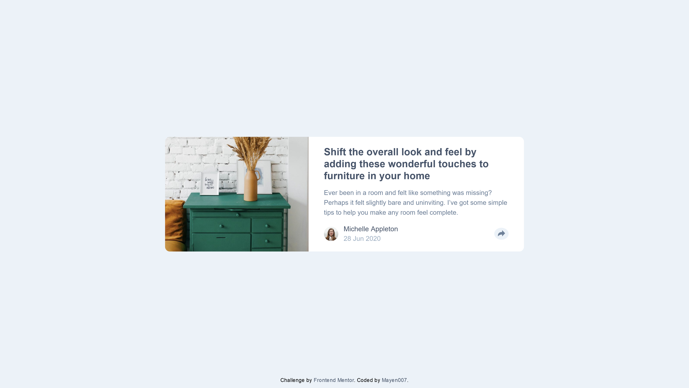

# Frontend Mentor - Article Preview Component Solution

This is my solution to the [Article Preview Component Challenge](https://www.frontendmentor.io/challenges/article-preview-component-dYBN_pYFT) on Frontend Mentor. It demonstrates the integration of semantic HTML, SCSS for modular styling, and JavaScript for interactive functionality.

## Table of Contents

- [Overview](#overview)
  - [The Challenge](#the-challenge)
  - [Screenshots](#screenshots)
  - [Links](#links)
- [My Process](#my-process)
  - [Built With](#built-with)
  - [Key Features](#key-features)
  - [Code Highlights](#code-highlights)
- [Author](#author)

---

## Overview

### The Challenge

Users should be able to:

- View the optimal layout for the component depending on their device's screen size.
- See the social media share links when they click the share icon.

### Screenshots

**Desktop View:**  


**Mobile View:**  


### Links

- **Solution URL:** [GitHub Repository](https://github.com/Mayen007/article-preview-component)
- **Live Site URL:** [Live Demo](https://your-live-site-url.com)

---

## My Process

### Built With

- **HTML5** - Semantic and accessible structure.
- **SCSS** - Modular and maintainable styling with variables, mixins, and nesting.
- **Vanilla JavaScript** - For managing interactivity.
- **Mobile-First Workflow** - Ensuring responsiveness from the ground up.

### Key Features

1. **Responsive Layout**

   - Desktop layout uses Flexbox for a side-by-side card design.
   - Mobile layout adapts with a column structure using media queries.

2. **Interactive Share Button**

   - A toggle effect to display or hide the share options on button click.

3. **SCSS Modularity**
   - Use of variables (`$very-dark-grayish-blue`, `$light-grayish-blue`) for consistent theming.
   - Media queries ensure responsiveness for screens below 768px.

### Code Highlights

#### SCSS: Styling the Card Component

The card design uses a mix of Flexbox and SCSS for modularity and clean code.

```scss
.card {
  position: absolute;
  top: 50%;
  left: 50%;
  transform: translate(-50%, -50%);
  display: flex;
  align-items: center;
  border-radius: 10px;
  background-color: white;
  max-width: 750px;
  width: 85%;

  &__image {
    width: 40%;
    object-fit: cover;
    border-radius: inherit;
  }

  &__content {
    width: 60%;
    padding: 1rem 2rem;
  }
}
```

#### JavaScript: Toggle Share Info

The share button toggles the visibility of the share info section dynamically.

```javascript
const shareButton = document.getElementById("share-button");
const shareInfo = document.getElementById("share__info");

shareButton.addEventListener("click", () => {
  shareInfo.classList.toggle("visible");
  console.log("Share button clicked");
});
```

#### Media Queries for Responsive Design

Using SCSS media queries, the layout shifts to a mobile-friendly design for smaller screens.

```scss
@media (max-width: 768px) {
  .card {
    flex-direction: column;
  }
  .card__image {
    width: 100%;
    border-radius: 10px 10px 0 0;
  }
}
```

## Author

- GitHub - [Mayen007](https://github.com/Mayen007)
- Frontend Mentor - [@Mayen007](https://www.frontendmentor.io/profile/Mayen007)
